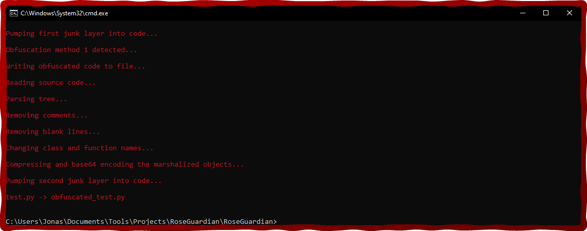

<div align="center" id="top"> 
  
  <br />
  <br />
  <p>:rose: A Python Code Obfuscator :shield:</p>
</div>

<h1 align="center">RoseGuardian</h1>

<p align="center">
  
  
  
</p>

<p align="center">
  <a href="#about">About</a> &#xa0; | &#xa0; 
  <a href="#features">Features</a> &#xa0; | &#xa0;
  <a href="#usage">Usage</a> &#xa0; | &#xa0;
  <a href="#license">License</a> &#xa0; | &#xa0;
  <a href="#author">Author</a>
</p>

<br>

<div id="about"></div>

## About :rose:

RoseGuardian is a powerful Python code obfuscator designed to safeguard your intellectual property. It employs advanced techniques to obscure your source code, making it significantly more challenging for potential reverse engineers to understand or modify.

<div id="features"></div>

## Features :sparkles:

- :closed_lock_with_key: Strong Class, Function, and Variable Renaming
- :inbox_tray: Code Compression with zlib
- :package: Create Marshalized Objects
- :scroll: Remove Docstrings and Comments

<div id="usage"></div>

## Usage :rocket:

For optimal obfuscation, it is recommended to set the junk layers to 10 and utilize obfuscation method 1.

```bash
# Clone the project
$ git clone https://github.com/DamagingRose/RoseGuardian.git

# Navigate to project directory
$ cd RoseGuardian

# Run the project
$ python RoseGuardian.py <your_file> <junk_layers> <obfuscation_method>
```

<div id="license"></div>

## License :page_facing_up:

This project is licensed under the EPL-2.0 license.

<div id="author"></div>

## Author :mortar_board:

Developed with :heart: by gumbobrot

<a href="#top">Back to top</a>
